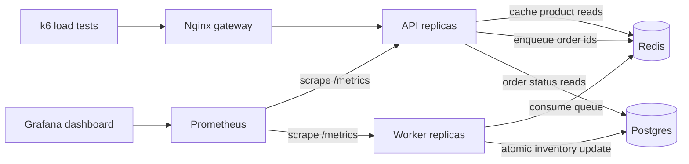

# Flash Sale Observability Demo

Small distributed system for an infrastructure interview. It models a flash-sale order path with an API, Redis queue/cache, async worker, Postgres inventory writes, Prometheus metrics, Grafana dashboard, and k6 load tests.

Live API: [`https://api-production-80a1.up.railway.app`](https://api-production-80a1.up.railway.app)

## Architecture



An editable Excalidraw version is included at [`architecture.excalidraw`](architecture.excalidraw).

## What This Demonstrates

- API replicas behind a gateway.
- Postgres as the source of truth for products, inventory, and orders.
- Redis as both a product-read cache and an async order queue.
- Worker replicas that own the hot inventory write path.
- Controlled backpressure with `MAX_QUEUE_DEPTH` when workers are saturated.
- Prometheus metrics and a pre-provisioned Grafana dashboard.
- k6 tests for read traffic, async order spikes, and synchronous baseline comparison.
- Backpressure through a Redis-backed per-IP rate limiter.

## Run Locally

```bash
docker compose up --build
```

Useful URLs:

- API: `http://localhost:3000`
- Products: `http://localhost:3000/products`
- Metrics: `http://localhost:3000/metrics`
- Prometheus: `http://localhost:9090`
- Grafana: `http://localhost:3100` with `admin` / `admin`

Create an async order:

```bash
curl -X POST http://localhost:3000/orders \
  -H 'Content-Type: application/json' \
  -H "Idempotency-Key: demo-$(date +%s)" \
  -d '{"productId":1}'
```

Check order status:

```bash
curl http://localhost:3000/orders/1
```

Reset all local state:

```bash
docker compose down -v
docker compose up --build
```

## API Surface

- `GET /health`: verifies API, Redis, and Postgres connectivity.
- `GET /products`: lists products with Redis caching.
- `POST /orders`: creates a pending order and pushes it to the Redis queue.
- `GET /orders/:id`: reads current order status.
- `POST /orders-sync`: comparison endpoint that performs the inventory write in the request path.
- `GET /metrics`: Prometheus metrics.

## Observe The System

Open Grafana and use the **Flash Sale Production Signals** dashboard.

Important panels:

- QPS by route.
- p50/p95 HTTP latency.
- Error/backpressure rate.
- Redis queue depth.
- Worker throughput.
- Final order outcomes.
- Database p95 latency.
- Redis cache hit rate.
- Inventory remaining.

The most important production signal is the relationship between `orders_enqueued_total`, `worker_jobs_total`, and `order_queue_depth`. When enqueue rate is higher than worker processing rate, the queue grows and order completion latency increases.

## Load Tests

Install k6, then run:

```bash
k6 run load/products.js
k6 run load/orders-spike.js
k6 run load/orders-sync-spike.js
```

Run the same tests against the Railway API:

```bash
BASE_URL=https://api-production-80a1.up.railway.app k6 run load/products.js
BASE_URL=https://api-production-80a1.up.railway.app k6 run load/orders-spike.js
```

Recommended demo sequence:

1. Run `load/products.js` and show the Redis cache hit rate rising.
2. Run `load/orders-sync-spike.js` to show the synchronous write path getting slower as Postgres becomes the bottleneck.
3. Run `load/orders-spike.js` to show the API staying responsive while queue depth exposes downstream saturation.

## Scaling Demo

Baseline:

```bash
docker compose up --build
k6 run load/orders-spike.js
```

Scale API replicas:

```bash
docker compose up --scale api=3
k6 run load/orders-spike.js
```

Scale workers:

```bash
docker compose up --scale api=3 --scale worker=3
k6 run load/orders-spike.js
```

Expected result on a real multi-node environment: API scaling improves request acceptance, but worker scaling is what drains the queue faster. On the local 2-CPU Colima VM used for this demo, scaling to 3 API and 3 worker containers made results worse because the host itself became saturated. See [`RESULTS.md`](RESULTS.md).

## Saturation Point Notes

Measured locally:

```text
1 API / 1 worker:
- 332.5 req/s over the full k6 run
- p95 API latency reached 987 ms
- HTTP failure rate reached 13.7%
- First failure mode: gateway/API EOFs under heavy connection pressure

3 API / 3 workers:
- 117.6 req/s over the full k6 run
- p95 API latency reached 2.38 s
- HTTP failure rate reached 34.3%
- Lesson: adding replicas on the same constrained VM increased contention instead of improving throughput
```

## What Breaks Under Load

- The synchronous endpoint ties user latency directly to Postgres writes.
- Async `/orders` protects API latency, but queue depth grows when workers cannot keep up.
- Worker replicas eventually contend on the same product inventory rows.
- Postgres connection limits and row locks become visible through DB p95 latency.
- The rate limiter returns `429` when one client/IP sends more traffic than the configured safe intake rate.
- The queue-depth guard returns `503 queue_full` when worker saturation would otherwise create unbounded backlog.

## Improvements Made

- Moved order processing out of the request path.
- Added Redis queue and horizontally scalable workers.
- Added idempotency keys so clients can safely retry.
- Added atomic inventory decrement to prevent overselling.
- Added product read caching.
- Added bounded queue backpressure with `MAX_QUEUE_DEPTH`.
- Added Prometheus metrics and Grafana dashboards.
- Added load tests that expose throughput, latency, queue depth, and saturation.

## Cloud Deployment

`railway.json` and startup schema creation are included so the same image can run on Railway. See [`DEPLOYMENT.md`](DEPLOYMENT.md).

Current cloud deployment:

- API: `https://api-production-80a1.up.railway.app`
- Worker: Railway private service.
- Postgres: Railway service running `postgres:16-alpine`.
- Redis: Railway service running `redis:7-alpine`.

## More Time

- Add OpenTelemetry traces across API, Redis, worker, and Postgres.
- Add a dead-letter queue with replay tooling.
- Autoscale workers from queue depth.
- Add alerting rules for p95 latency, error rate, and queue age.
- Deploy to Kubernetes with HPA and managed Postgres/Redis.
- Add CI, Terraform, and a cloud-hosted demo environment.
- Track queue age, not just queue depth, for better user-impact measurement.
